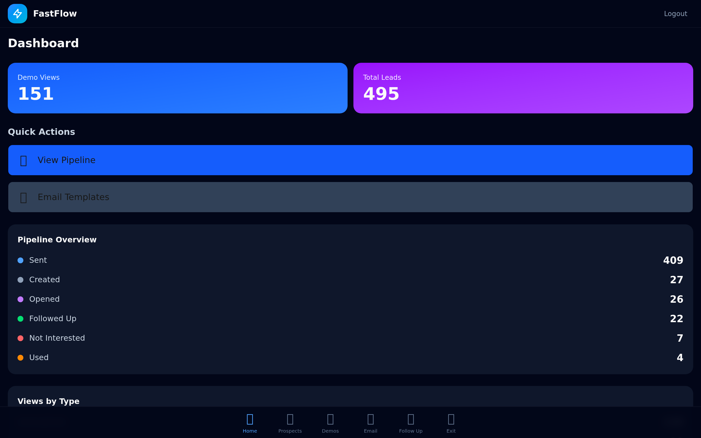

<div align="center">

  # 📊 FastFlow Admin
  ### The Command Center for AI-Powered Lead Generation

  Manage leads, track demos, send follow-ups, and monitor your entire sales pipeline from one dashboard.

  [🌐 Live Dashboard](https://fastflow-admin.vercel.app) · [⚡ FastFlow Site](https://fastflow.bek-tech.com) · [📧 Contact](mailto:fastflow@bek-tech.com)

  

</div>

---

## ✨ Features

### 🏠 Dashboard
Real-time metrics — demo views, total leads, pipeline breakdown by stage, views by type.

### 🎯 Leads Pipeline (Kanban)
Drag-and-drop kanban board with stages: Created → Sent → Opened → Followed Up → Used → Not Interested. Sort by email availability, filter by call status.

### 📧 Email Templates
Niche-aware outreach email templates for 16+ industries. Auto-detects the right template from business name or stored niche. Preview before sending, edit recipient name/email inline.

### 🔄 Follow-Up Automation
One-click follow-up emails with promo code integration (SWFL50). Bounce-aware email selection, manual override for name/email, inline HTML preview.

### 📞 Prospects
Outbound calling with Twilio integration. After-hours detection to identify businesses without 24/7 coverage — prime targets for AI voice employees.

### 📊 Demos
Track every demo view with analytics — who viewed, when, what type (voice phone, web chat), and interaction data.

---

## 🏗️ Architecture

| Layer | Tech |
|-------|------|
| Framework | Next.js 16 (App Router, Turbopack) |
| UI | React 19, Tailwind CSS |
| Database | Vercel Postgres (Neon) |
| Auth | JWT with cookie-based sessions |
| Email | Zoho Mail API |
| Voice | Twilio + Vapi |
| Payments | Stripe |
| Deployment | Vercel |

---

## 🚀 Quick Start

### 1. Database

```bash
vercel postgres create fastflow-db
```

Run `src/lib/db/schema.sql` to set up tables.

### 2. Environment Variables

| Variable | Description |
|----------|-------------|
| `POSTGRES_URL` | Auto-added by Vercel Postgres |
| `ADMIN_PASSWORD` | Login password |
| `ADMIN_JWT_SECRET` | JWT signing secret |
| `STRIPE_SECRET_KEY` | Stripe API key |
| `TWILIO_ACCOUNT_SID` | Twilio credentials |
| `TWILIO_AUTH_TOKEN` | Twilio auth |
| `TWILIO_PHONE_NUMBER` | Outbound caller ID |

### 3. Deploy

```bash
npm install
npm run dev      # Local development
vercel --prod    # Deploy to production
```

---

## 📡 API Endpoints

<details>
<summary><b>Auth</b></summary>

- `POST /api/auth/login` — Login
- `POST /api/auth/logout` — Logout
- `GET /api/auth/status` — Check session

</details>

<details>
<summary><b>Leads</b></summary>

- `GET /api/leads` — List leads (supports `?stats=true`)
- `POST /api/leads` — Create lead
- `GET /api/leads/[id]` — Get single lead
- `PATCH /api/leads/[id]` — Update lead
- `POST /api/leads/import` — Bulk import from CSV
- `POST /api/leads/bulk-update` — Bulk status updates

</details>

<details>
<summary><b>Prospects & Calls</b></summary>

- `GET /api/prospects` — List prospects
- `POST /api/prospects/call` — Initiate outbound call
- `POST /api/prospects/call-webhook` — Twilio call status webhook
- `POST /api/calls/outbound` — Place outbound call
- `POST /api/calls/webhook` — Call webhook handler

</details>

<details>
<summary><b>Email</b></summary>

- `POST /api/email/send` — Send outreach or follow-up email

</details>

---

## 📈 Current Scale

- **495+ leads** managed
- **151+ demo views** tracked
- **16 niche industries** with tailored templates
- **22 follow-ups sent** through the dashboard
- **Pipeline value:** $2,161+

---

<div align="center">

  Built by [BEK Tech](https://bek-tech.com) · Powered by [FastFlow](https://fastflow.bek-tech.com)

</div>
